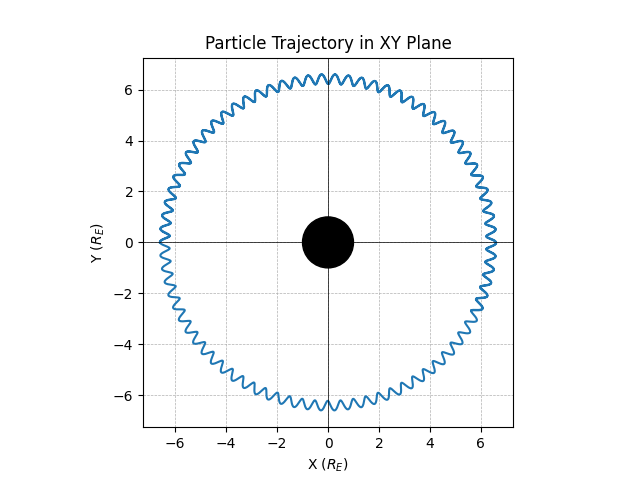

.. _examples:

#########
Examples
#########

.. contents::
   :depth: 3

Performing Traces
*****************

Setting up Initial Conditions
===========================
Initial conditions are configured using the `~disco.ParticleState` class. In the below example, we setup one particle starting at (-6.6, 0, 0) Earth Radii. To configure multiple particles, arrays of longer length can be provided. 

Because DISCO uses the mass and charge of the particles to dimensionalize the simulation, it can only do traces for one combination of mass and charge at a time. 
Unless otherwise specified, all coordinates used in DISCO are Solar Magnetic (SM).

.. code-block:: python

    import disco
    from astropy import constants, units
    import numpy as np

    particle_state = disco.ParticleState(
        x = np.array([-6.6]) * constants.R_earth,
        y = np.array([0.0]) * constants.R_earth,
        z = np.array([0.0]) * constants.R_earth,
        ppar = np.array([0.8]) * constants.m_e * constants.c,
        magnetic_moment = np.array([800]) * units.MeV / units.G,
        mass = constants.m_e,
        charge = constants.e.si,
    )
	

Setting Magnetic and Electric Field Models
==========================================
Traces can be performed in magnetic and electric field context loaded from output of MHD simulations or taken directly from user-provided arrays.

Currently, loading output from the `Space Weather Modeling Framework (SWMF) <https://clasp.engin.umich.edu/research/theory-computational-methods/space-weather-modeling-framework/>`_ is built-in, with future plans to add support for `MAGE <https://cgs.jhuapl.edu/Models/mage.php>`_. To load from the output of MHD simulations, we use the `disco.readers` module. Below is an example loading from SWMF. 

.. code-block:: python

   import disco
   from disco.readers import SwmfOutFieldModelDataset
   
   dataset = SwmfOutFieldModelDataset('swmf_run/*.out')

   field_model_loader = disco.LazyFieldModelLoader(
      dataset, config, particle_state.mass, particle_state.charge
   )

To directly provide the fields in arrays, the following snippet can be used. The magnetic field is expected to be the *external* magnetic field, i.e. with the dipole subtracted. The strength of the dipole used during interpolation can be configured with the `B0` keyword argument.

.. code-block:: python

    import disco
    from astropy import constants, units
    import numpy as np
    
    # Setup axes for the field model
    grid_spacing = 0.1
    x_axis = np.arange(-10, 10, grid_spacing) * constants.R_earth
    y_axis = np.arange(-10, 10, grid_spacing) * constants.R_earth
    z_axis = np.arange(-5, 5, grid_spacing) * constants.R_earth
    t_axis = np.array([0, 60]) * units.s

    x_grid, y_grid, z_grid, t_grid = np.meshgrid(
        x_axis, y_axis, z_axis, t_axis, indexing="ij"
    )

    r_inner = 1 * constants.R_earth

    axes = disco.Axes(x_axis, y_axis, z_axis, t_axis, r_inner)

    # Setup field model (zero external field --> dipole)
    Bx = np.zeros(x_grid.shape) * units.nT
    By = np.zeros(Bx.shape) * units.nT
    Bz = np.zeros(Bx.shape) * units.nT
    Ex = np.zeros(Bx.shape) * units.mV / units.m
    Ey = np.zeros(Bx.shape) * units.mV / units.m
    Ez = np.zeros(Bx.shape) * units.mV / units.m
    
    field_model = disco.FieldModel(Bx, By, Bz, Ex, Ey, Ez, axes)

    
DISCO requires at least two timesteps of field model context so that it can interpolate in both space and time. If you only have one timestep, use the `duplicate_in_time()` method to synthetically copy it to two timesteps.

.. code-block:: python

    import disco
		
    field_model = disco.FieldModel(Bx, By, Bz, Ex, Ey, Ez, axes)
    field_model = field_model.duplicate_in_time()		

Starting the Trace
===================
The last thing to setup is the `disco.TraceConfig` object, which controls configuration options for trace. To do a trace between two times, we can specify the `t_initial` and `t_final` parameters. 

An important parameters for `disco.TraceConfig` is `output_freq`, which controls how often the trace will output results. By default, only the first and last timesteps are outputted, so if you want to output every timestep, you need to set `output_freq=1`.

.. code-block:: python

    import disco
    from astropy import units

    config = disco.TraceConfig(
        t_initial = 0 * units.s,
        t_final = 30 * units.s,
        output_freq = 1,  # Output every timestep
    )

Now we can perform the trace using `disco.trace_trajectory()`. This function takes the `config`, `particle_state`, and `field_model_loader` as arguments, and returns a `disco.ParticleHistory` object that contains the results of the trace. If you created a `disco.FieldModel` directly from arrays, you can pass it instead of `field_model_loader`.

.. code-block:: python

    import disco
        
    history = disco.trace_trajectory(
        config, particle_state, field_model_loader
    )

How that you have a history object, you can move on to the next section to save it or plot it.

Saving and Plotting Results
******************************

Saving and Loading from Disk
=============================

When a trace is performed with `disco.trace_trajectory()`, it returns an instance of `disco.ParticleHistory`. This object can be saved to an HDF5 file using the `history.save()` method:

.. code-block:: python

    import disco		
		
    history = disco.trace_trajectory(
       config, particle_state, field_model_loader
    )

    history.save('DiscoTrajectoryOutput.h5')

Later on, the object can be restored from this HDF5 file using the `disco.ParticleHistory.load()` method:

.. code-block:: python

    history = disco.ParticleHistory.load('DiscoTrajectoryOutput.h5')		

Built-in Plotting Methods
=============================

The `disco.ParticleHistory` object has built-in plotting methods to visualize the results of the trace. The `history.plot_xy()` method plots the trajectory in the XY plane, while `plot_xz()` and `plot_yz()` plot the trajectory in the XZ and YZ planes, respectively. These methods can be passed a matplotlib axes object to plot on, or they will create a new figure and axes if none is provided.

.. code-block:: python

    import disco
    from matplotlib import pyplot as plt

    history.plot_xy()  # Plot trajectory in XY plane
    plt.savefig('trajectory_xy.png')

The plotting methods also support the `inds=` keyword argument, which allows you to plot only a subset of the particles in the history. For example, to plot only the first particle, you can do:

.. code-block:: python

    # Plot only the first particle in XY plane
    history.plot_xy(inds=[0])
 
Also supported is a `sample=` keyword argument, which allows you to plot only random sample of the particles traces.  For examples, to plot a random sample of 1,000 particles, you can do:

.. code-block:: python

    # Plot a random sample of 1,000 particles in XY plane
    history.plot_xy(sample=1000)

Advanced Options
*****************

Backwards-Time Integration
===========================
Backwards time integration can be done by passing `integrate_backwards=True` to `disco.TraceConfig`. When this is done, the value of `t_final` should be less than `t_initial`. The value of the default step size, `h_initial`, should always be positive.

.. code-block:: python

    import disco
    from astropy import units
    
    config = disco.TraceConfig(
        t_initial = 0 * units.s,
        t_final = -30 * units.s,
        integrate_backwards=True,
    )

Tracing in non-Time-Dependent Fields 
==========================================
DISCO requires at least two timesteps of field model context so that it can interpolate in both space and time.

If you are loading from simulation output, index the dataset at the desired timestep position and call the `duplicate_in_time()` function to create a `disco.FieldModel` which you can pass to `disco.trace_trajectory()`.

.. code-block:: python

    from disco.readers import SwmfOutFieldModelDataset
    
    dataset = SwmfOutFieldModelDataset('swmf_run/*.out')
    field_model = dataset[0].duplicate_in_time()

If you are directly providing arrays for the magnetic and electric field context, simply call `duplicate_in_time()` on the `disco.FieldModel` instance.

.. code-block:: python

    import disco
    
    field_model = disco.FieldModel(Bx, By, Bz, Ex, Ey, Ez, axes)
    field_model = field_model.duplicate_in_time()		

Loading from Custom Simulation Output
=====================================
For ambitious users who want to support dynamic loading of non-built-in magnetic and electric field models, this can be done by authoring a subclass of `disco.readers.FieldModelDataset`. The user will need to implement the following methods:

* `__len__(self)`: returns the number of timesteps in the dataset
* `__getitem__(self, index)`: returns a `disco.FieldModel` instance, with a single timestep, for the given timestep index. The `Axes` used to create this `FieldModel` should have the single timestep `t` value set correctly.
* `get_time_axis(self)`: returns an array with units of time, of size equal to the number of timesteps, that describes the timestamps of each index

When that subclass is implemented and working, it can be used with `disco.LazyFieldModelLoader`, which will call `__getitem__` on demand as new timesteps are needed. This instance of `disco.LazyFieldModelLoader` can be passed to `disco.trace_trajectory` to cause the trace to use your output.

.. code-block:: python

    import disco
		
    dataset = MyDataset("some_directory/*.cdf")
    
    field_model_loader = disco.LazyFieldModelLoader(
        dataset, config, particle_state.mass, particle_state.charge
    )
