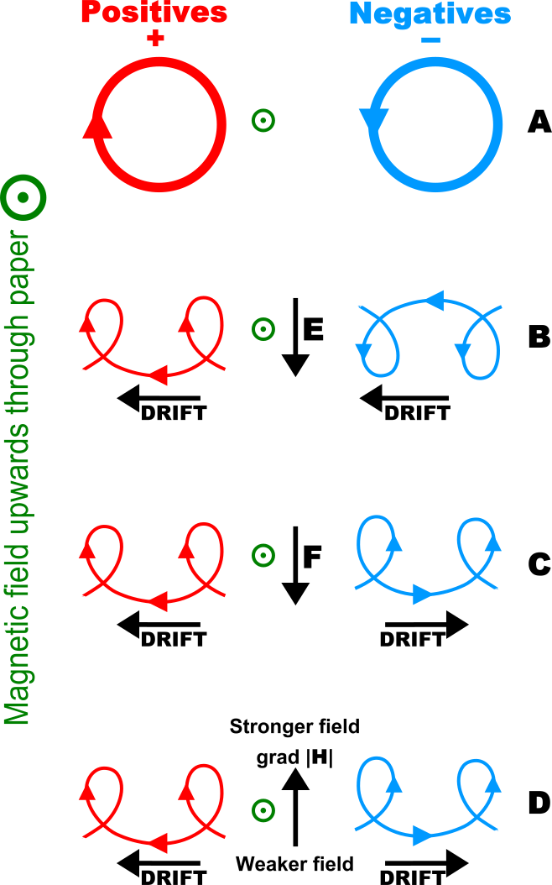

.. _guiding-center:

#########
Guiding Center Methodology
#########

DISCO traces particle trajectories using the guiding center approximation, which is a method for simulating the motion of charged particles in a magnetic field. This approximation simplifies the equations of motion by averaging over the fast gyromotion of the particles around magnetic field lines, allowing for larger time steps and more efficient simulations.  

It is important to note that the guiding center approximation is valid when the particle's gyroradius is small compared to the characteristic length scales of the magnetic field, and when the particle's velocity is not too high. In cases where these conditions are not met, the full equations of motion may need to be solved with another tool for accurate results.

The guiding center equations of motion are derived from the Lorentz force and can be expressed as follows ( `Brizard & Chan, 1999 <https://doi.org/10.1063/1.873742>`_, `Elkington et al., 2002 <https://doi.org/10.1016/S1364-6826(02)00018-4>`_):

.. math::

    \frac{d\mathbf{r}}{dt} &= c \frac{\mathbf{E} \times \mathbf{\hat{b}}}{B_\parallel^*} + \frac{Mc}{q\gamma} + \frac{\hat{\mathbf{b}}\times \nabla B}{B_\parallel^*} + \frac{p_\parallel \mathbf{B}^*}{m\gamma \mathbf{B}_\parallel^*} \\
    \frac{d p_\parallel}{dt} &= \frac{B^*}{B_\parallel^*} \left( q E - \frac{M}{\gamma} \nabla B \right) \\
    \frac{dM}{dt} &= 0\\
    \mathbf{B^*} &= \mathbf{B} + \frac{c p_\parallel}{q} \nabla \times \hat{\mathbf{b}} \\
    B_\parallel^* &= \hat{\mathbf{b}} \cdot \mathbf{B^*} = B ( 1 + \frac{c p_\parallel}{q B} \hat{\mathbf{b}} \cdot \nabla \times \hat{\mathbf{b}} )

Where

- :math:`\mathbf{r}` is the guiding center position
- :math:`p_\parallel` is the parallel momentum
- :math:`M` is the magnetic moment
- :math:`\mathbf{E}` is the electric field
- :math:`\mathbf{B}` is the magnetic field
- :math:`\hat{\mathbf{b}}` is the unit vector along the magnetic field
- :math:`c` is the speed of light
- :math:`q` is the particle charge
- :math:`m` is the particle mass
- :math:`\gamma` is the relativistic factor

Finally, we note that we use a dimensionalization scheme when solving the equatiosn for efficiency. The dimensionalization scheme is:

.. math::

    r \rightarrow \frac{r}{R_E} \\
    t \rightarrow \frac{c}{R_E}t \\
    M \rightarrow \frac{M}{q R_E} \\
    B \rightarrow \frac{qR_E}{mc^2}B \\
    E \rightarrow \frac{qR_E}{mc^2}E \\