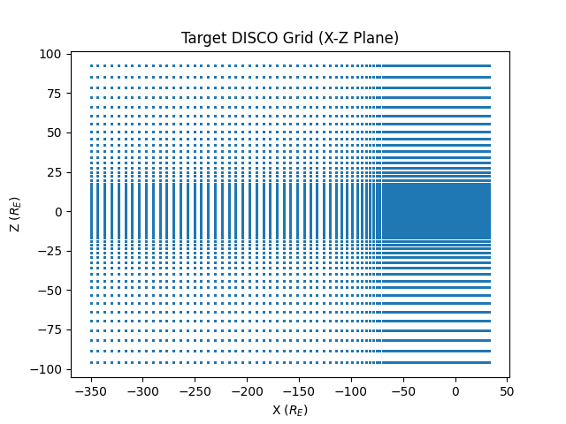
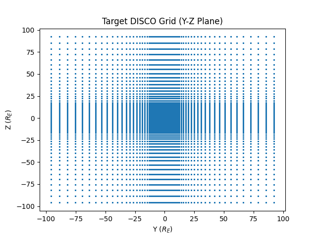

.. _regridding:

#########
Regridding Methodology
#########

DISCO regrids the output of MHD simulations to a regular grid in order to make it easier to analyze and visualize the data. The regridding process involves interpolating the data from the original grid to a new rectilinear grid. 

By default regridding is done on the fly as particles reach new temporal slices of MHD output, and the regridded output is cached on disk alongside the original files.

Target Grid
------------
The target grid is an OpenGGCM overview grid, with about 2.95M cells. This is a rectilinear grid with higher density around the magnetopause and inner magnetosphere, and lower density in the solar wind and tail region. This grid is based on the 11.8M grid obtained by the CCMC, but has been downsampled for the particle tracing task.

Coordinate System
------------------
DISCO works in the SM coordinate system, which is a geocentric solar magnetic coordinate system. In this system, the X-axis points from the Earth towards the Sun, the Z-axis points towards the north magnetic pole, and the Y-axis completes the right-handed coordinate system. 

Resampling Algorithm
--------------------
The regridding process uses k-NN averaging based on a k-d tree. To interpolate at each point, we use 16 neighbors, and average the neighboring values using radial basis functions with a Gaussian kernel. The kernel width is determined by the average distance to the neighbors, ensuring that the interpolation is smooth and accurate. As much as possible, the regridding is done on the GPU.

Internal versus External Field
------------------------------
As much as possible, DISCO works with the external field and evaluates the exact dipole field at each point. During the regridding process, the dipole moment is first subtracted off. When working with classes like `~disco.readers.SwmfOutFieldModelDataset`, a parameter called `B0` can be used to specify the dipole moment, which will be subtracted off during regridding. This allows for more accurate interpolation of the external field, while still allowing for the exact dipole field to be evaluated at each point when needed.
